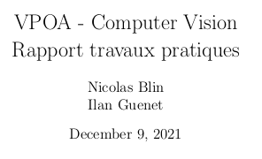
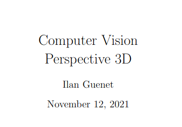

# Computer Vision exercises

Computer vision exercises using [OpenCV](https://opencv.org/)

## Summary
1. 3D Perception (folder: [Perception3D](Perception3D))
    1. Calibration
    2. Rectification
    3. Monovision
    4. Stereovision
2. Segementation & Registration (folder: [Segmentation_Registration](Segmentation_Registration))
    1. Segmentation
    2. Registration
        1. RANSAC
        2. ICP
3. 3D Localisation (folder: [Localisation](Localisation))
    1. Pose estimation
    2. Tracking

## Papers

### Report

A report for every part can be found [here](report.pdf). You can find mathematical explanations and visual results.
<a href="report.pdf"></a>

### 3D perspective

An article (in french) explaining the **3D Perspective** mostly used for the **Calibration** can be found [here](https://github.com/Li0nMo0se/computer-vision-perception-3D)
<a href="https://github.com/Li0nMo0se/computer-vision-perception-3D"></a>

## Usage

For convenient execution, you may use a `python venv` and then install the requirements with `pip`.

Create a `python venv`
```
$ python -m venv .venv
$ source .venv/bin/activate
```

Install the requirements
```
pip install -r requirements.txt
```

### 3D Perception 

Script:
* Monovision: [Perception3D/MonoMain.py](Perception3D/MonoMain.py)
* Stereovision: [Perception3D/StereoMain.py](Perception3D/StereoMain.py)

Both script will do the calibration first and the rectification in second. The matrices `cameraMatrix` and `distCoeffs` will be printed.

### Segementation & Registration

Script:
* [Segmentation_Registration/Crop.py](Segmentation_Registration/Crop.py) to get the reference object in a point cloud
* [Segmentation_Registration/Main.py](Segmentation_Registration/Main.py) executes the registration from a `source_file` to a `target_file` (variable in the script) 

### Localisation

Script:
* [Localisation/Main.py](Localisation/Main.py)
    * Change the `cameraMatrix` and `distCoeffs` computed from the calibration.
    * The script will by default track a `EPITA student card`.
    * Feel free to track anything, the reference image must loaded in `img_object` variable
